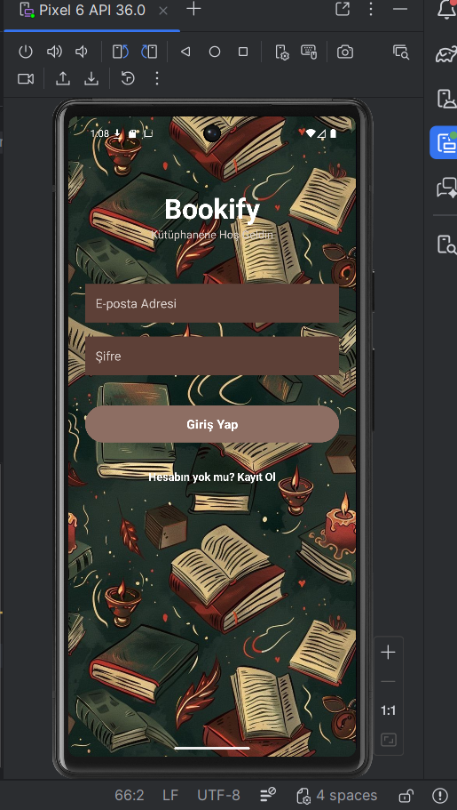
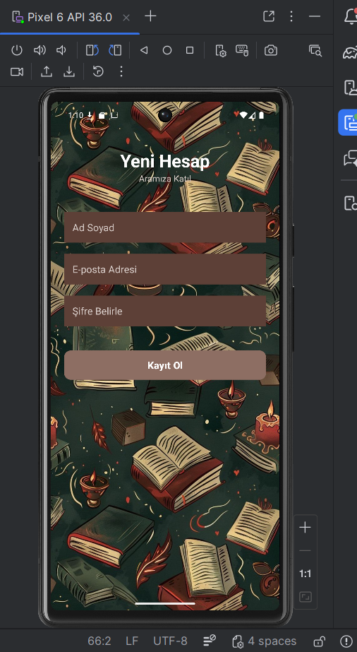
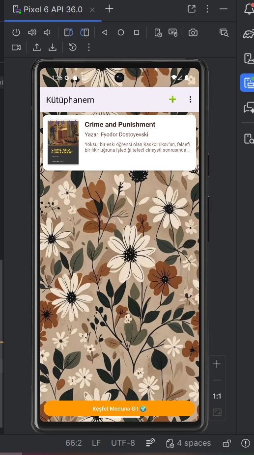
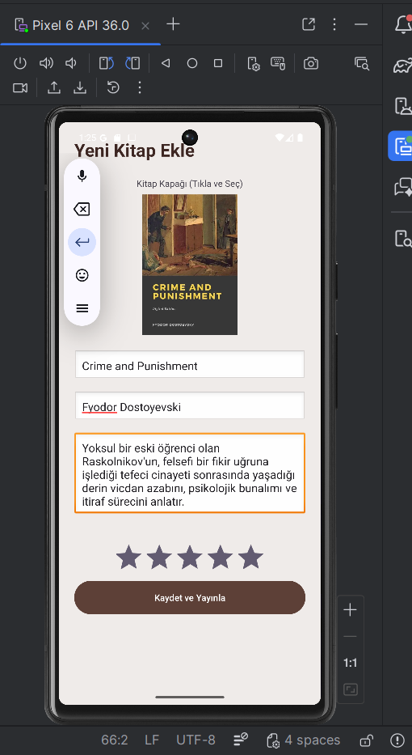
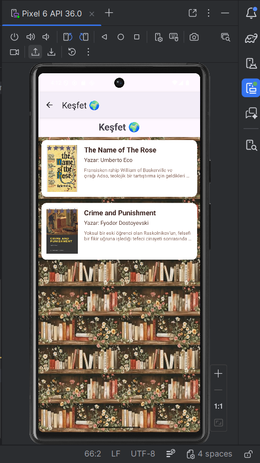
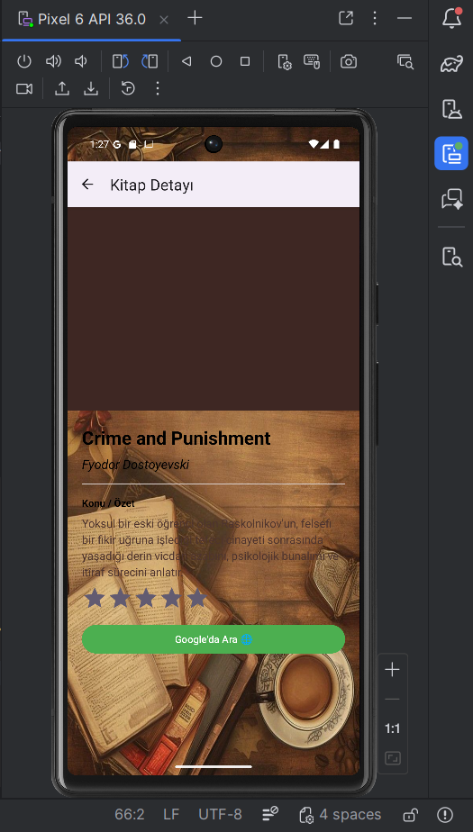

# 📚 Bookify

Bookify is an Android application that allows users to build their own digital library, share books with other users, and discover books shared by the community.

The application is developed using **Kotlin**, **MVVM Architecture**, **Firebase Authentication**, and **Cloud Firestore**.

---

# ✨ Features

- 🔐 User Registration & Login
- 📚 Personal Library
- ➕ Add New Books
- 🌍 Explore Books Shared by Other Users
- 📖 Book Detail Page
- ⭐ Book Rating System
- 🔍 Search Books on Google
- ☁️ Firebase Authentication
- 🔥 Cloud Firestore Integration
- 🎨 Modern Material Design UI

---

# 🛠️ Technologies

- Kotlin
- Android Studio
- MVVM Architecture
- Firebase Authentication
- Cloud Firestore
- RecyclerView
- Glide
- Material Design Components

---

# 📱 Screenshots

## 🔑 Login Screen



---

## 📝 Register Screen



---

## 📚 My Library

Users can manage and view the books they have added.



---

## ➕ Add Book

Users can add a new book by selecting a cover image and entering the book information.



---

## 🌍 Explore Books

Browse books shared by all users.



---

## 📖 Book Detail

Displays detailed information about a selected book, including title, author, description, rating, and a button to search the book on Google.



---

# 📂 Project Structure

```
app/
├── data/
├── model/
├── repository/
├── ui/
│   ├── login/
│   ├── register/
│   ├── library/
│   ├── addbook/
│   ├── explore/
│   └── detail/
├── viewmodel/
└── utils/
```

---

# 🚀 Getting Started

### 1. Clone the repository

```bash
git clone https://github.com/fatmasuleoz/Bookify.git
```

### 2. Open the project

Open the project in Android Studio.

### 3. Configure Firebase

Create your own Firebase project and place the `google-services.json` file inside the `app` directory.

Enable the following Firebase services:

- Firebase Authentication (Email/Password)
- Cloud Firestore

### 4. Run the application

Build and run the project on an Android device or emulator.
